# Processing Visuals

Algorithms for visualizations in processing🧑‍🎨

## Clouds Randomised Algorithm ☁️

### Description

Randomised algorithm for making a visual with the arc construct. The background is a gradient, representing the blue sky. The white arcs form a lot of abstract clouds, varying in opacity and thickness. The sketch automaticaly saves a screenshot when the letter S is pressed, with the name being the current time and date.

___

### Images

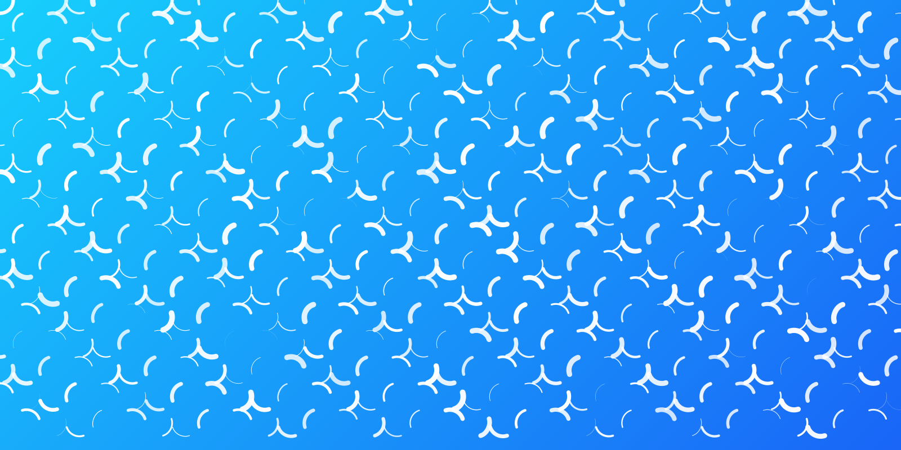
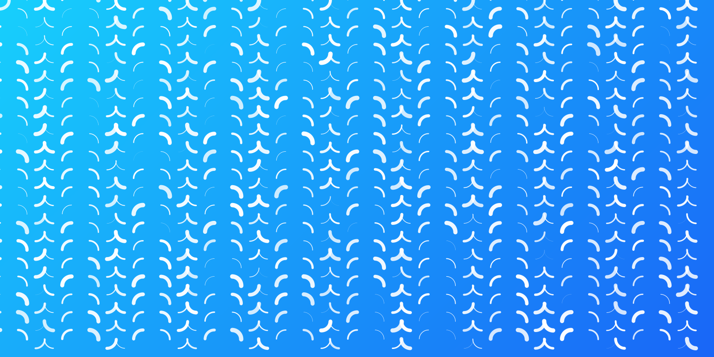

___

## BONUS: George Nees Algorithm 🪄

### Description

Randomised algorithm for making a visual with lines that all start from the previous line's ending point. The lines alternate vertically and horizontally, so it appears that they make a square turn. At the end beginning of the first line is connected with the end of the lst line directly.

___

### Images

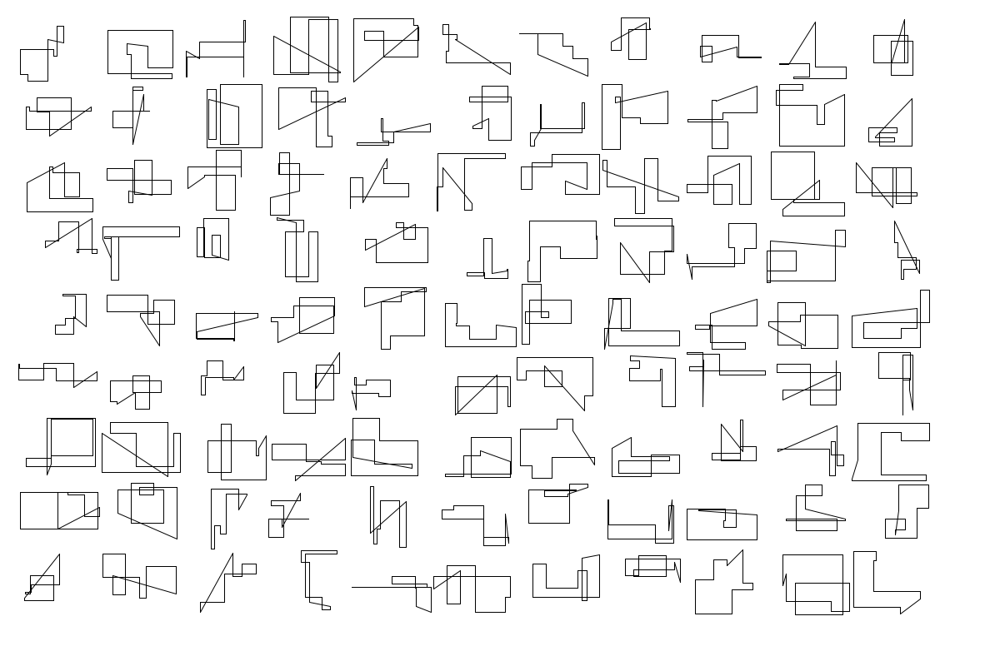
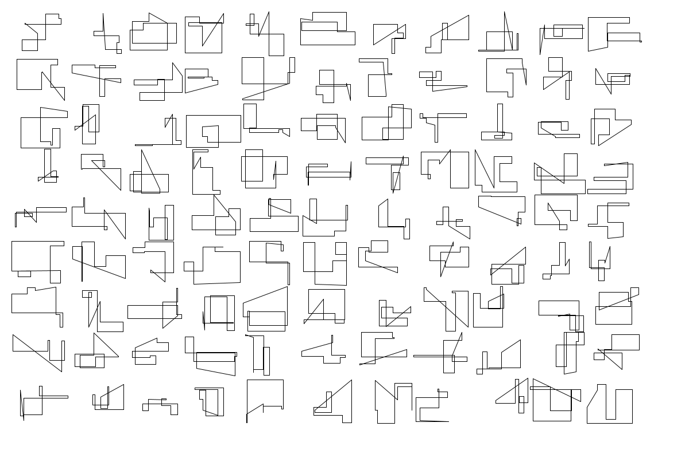
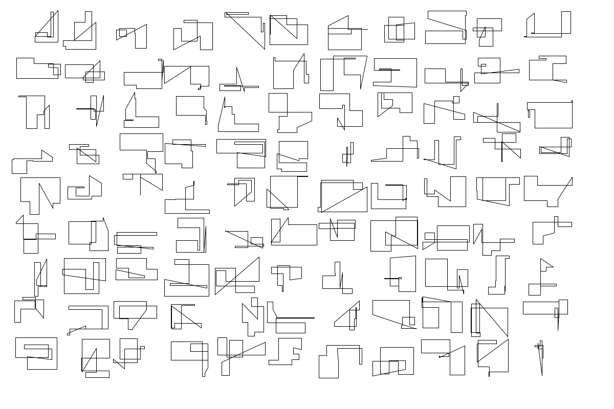
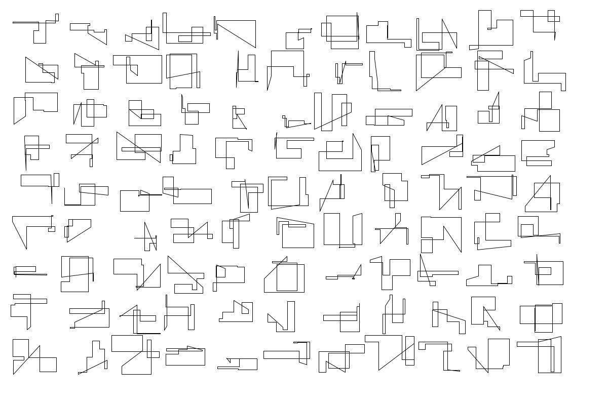
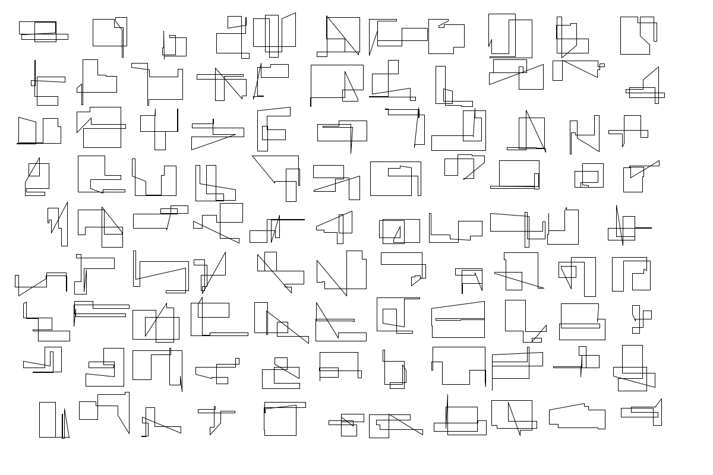

___

## Sound Visualization 🔊

### Description

This sketch automatically plays through the whole new MBT album - [Dopamina](https://music.youtube.com/playlist?list=OLAK5uy_kup6ajGtwlFozY27n9nh-G4WniKD9ecyw) and displays a circular waveform spectrum with dinamic colors and pulsing circles inside. The currently playing song is displayed at the top of the screen. On mouse click the next song is loaded. The sketch uses the library Minim for sound playback and visualizations.

___

### Images

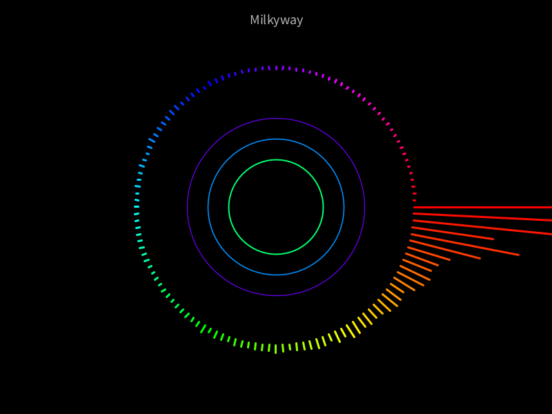

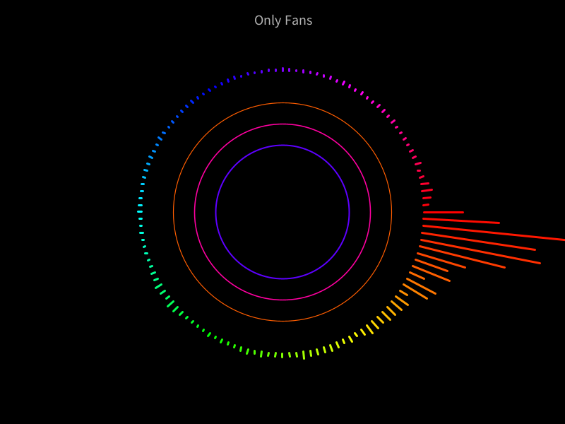
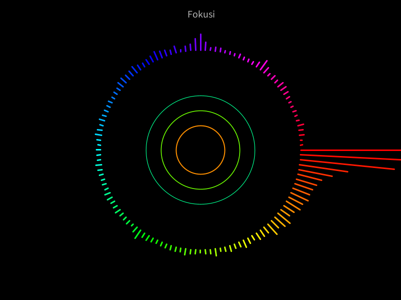
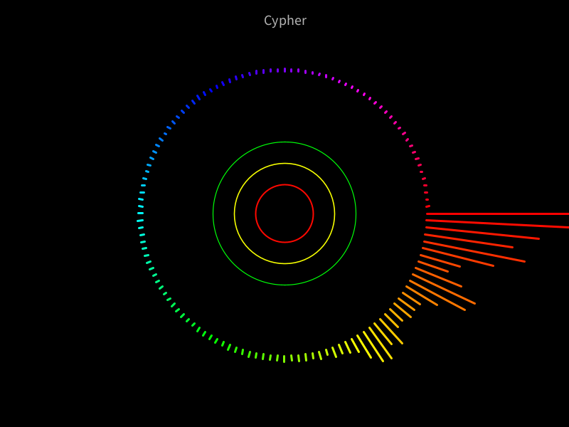

___