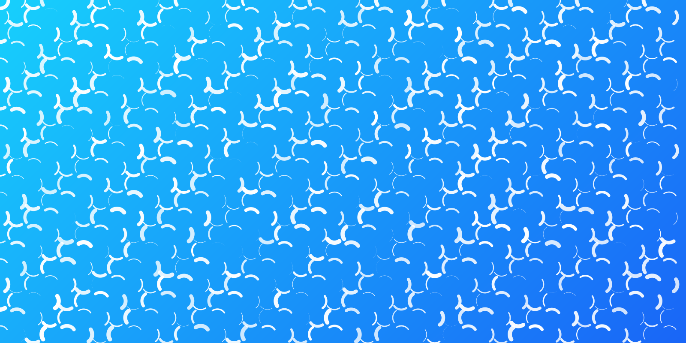

# Processing Visuals

Algorithms for visualisations in processing🧑‍🎨

## Clouds Randomised Algorithm

### Description

Randomised algorithm for making a visual with the arc construct. The background is a gradient, representing the blue sky. The white arcs form a lot of abstract clouds, varying in opacity and thickness ☁️. The sketch automaticaly saves a screenshot when the letter S is pressed, with the name being the current time and date.

___

### Images

___

## BONUS: George Nees Algorithm

### Description

    Randomised algorithm for making a visual with lines that all start from the previous line's ending point. The lines alternate vertically and horizontally, so it appears that they make a square turn. At the end beginning of the first line is connected with the end of the lst line directly.

___

### Images

___

