# Processing Visuals

Algorithms for visualizations in Processing🧑‍🎨

## Clouds Randomised Algorithm ☁️

### Description

Randomised algorithm for making a visual with the arc construct. The background is a gradient, representing the blue sky. The white arcs form a lot of abstract clouds, varying in opacity and thickness. The sketch automaticaly saves a screenshot when the letter S is pressed, with the name being the current time and date.

___

### Images

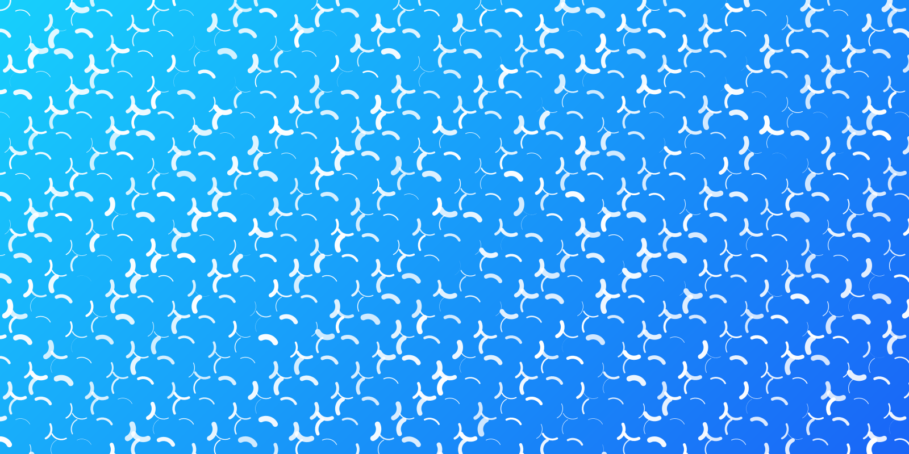

___

## BONUS: George Nees Algorithm 🪄

### Description

Randomised algorithm for making a visual with lines that all start from the previous line's ending point. The lines alternate vertically and horizontally, so it appears that they make a square turn. At the end beginning of the first line is connected with the end of the lst line directly.

___

### Images

___

## Sound Visualization 🔊

### Description

This sketch automatically plays through the whole new MBT album - [Dopamina](https://music.youtube.com/playlist?list=OLAK5uy_kup6ajGtwlFozY27n9nh-G4WniKD9ecyw) and displays a circular waveform spectrum with dinamic colors and pulsing circles inside. The currently playing song is displayed at the top of the screen. On mouse click the next song is loaded. The sketch uses the library Minim for sound playback and visualizations.

___

### Images

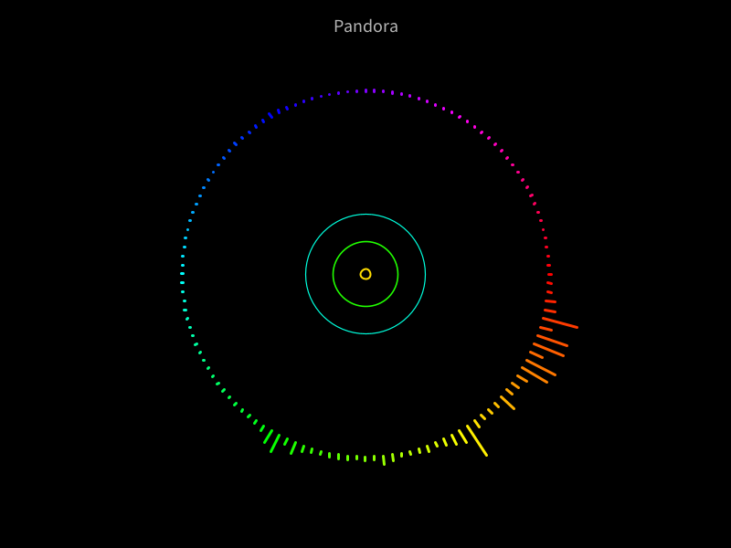

___

## BONUS: Lines in 4 directions Algorithm 📏

### Description

This sketch overlaps four patterns: 
1. Horizontal lines in black with random length
2. Vertical lines in yellow with random length
3. Diagonal lines from left to right in red with random length
4. Diagonal lines from right to left in blue with random length

___

### Images

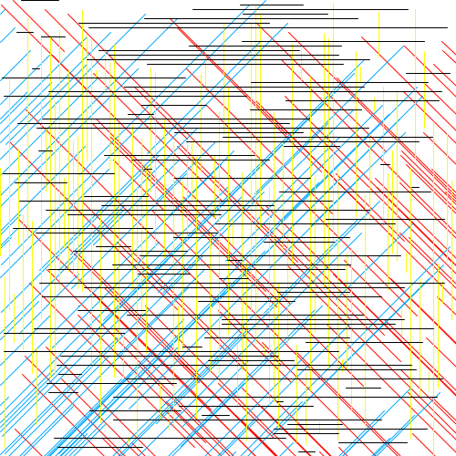
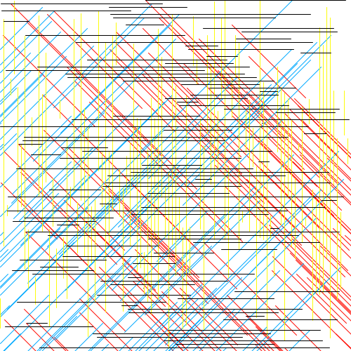
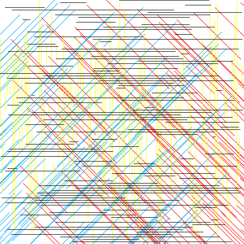
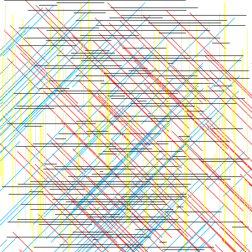
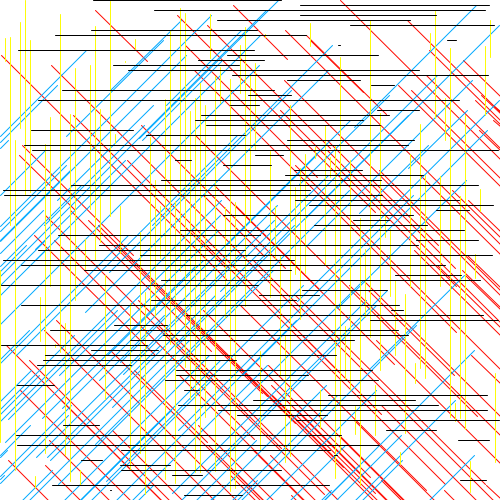

___

## BONUS: Light, shadow and overlapping 🟨

### Description

The sketch draws a certain number of rectangles with random position and size. Every next shape has lower opacity and on each rectangle the color switches between orange and red.

___

### Images

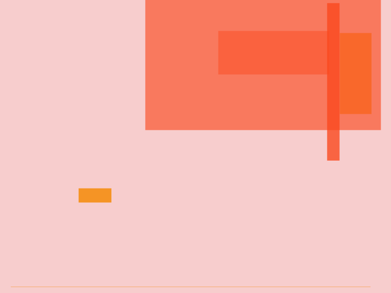

___

## BONUS: Vera Molnar - Des Ordres (The Final Boss 😱)

### Description

The sketch draws an inception of slightly distorted squares with random colors throughout the whole screen. 

___

### Images

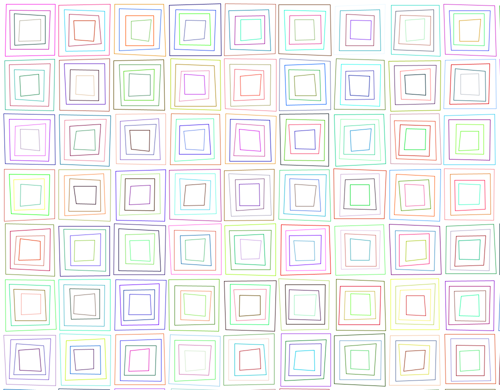
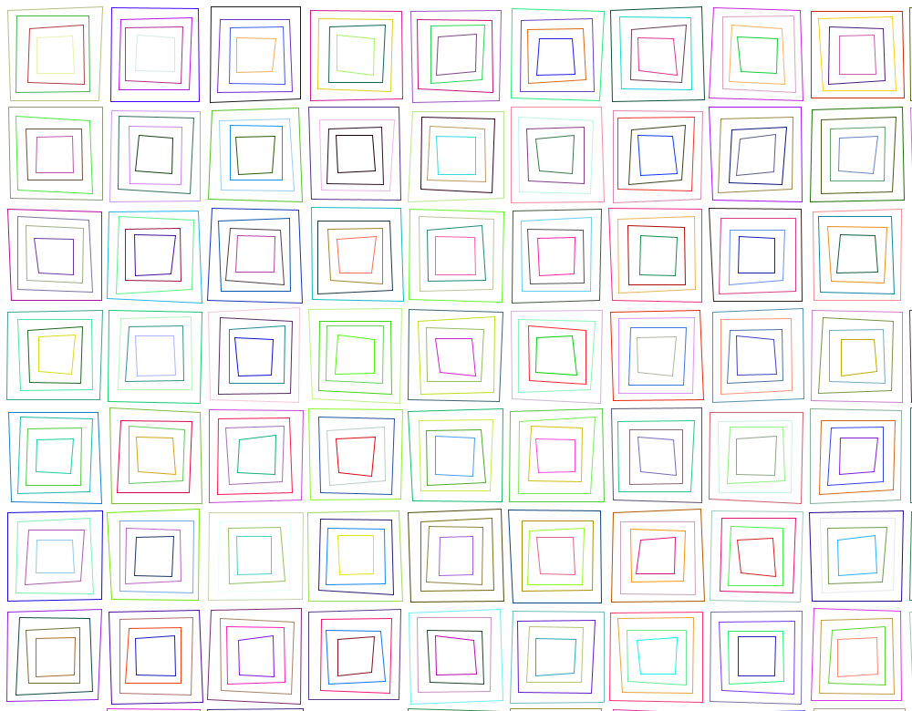
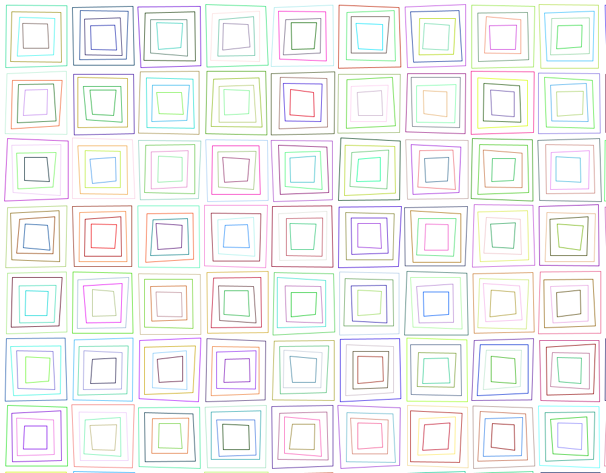
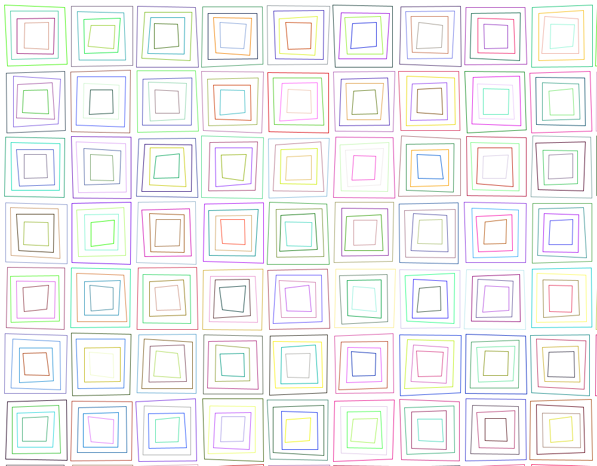
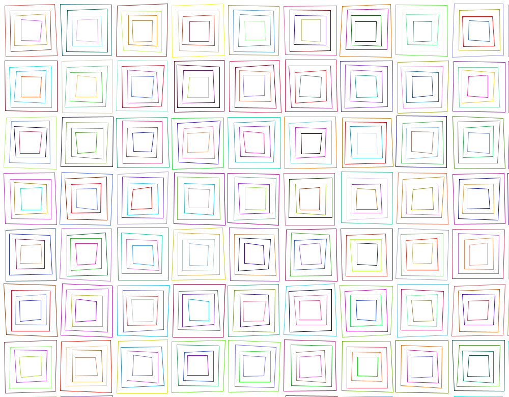

___